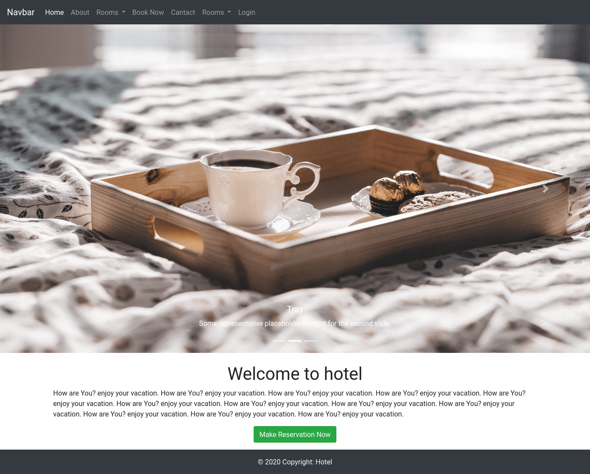
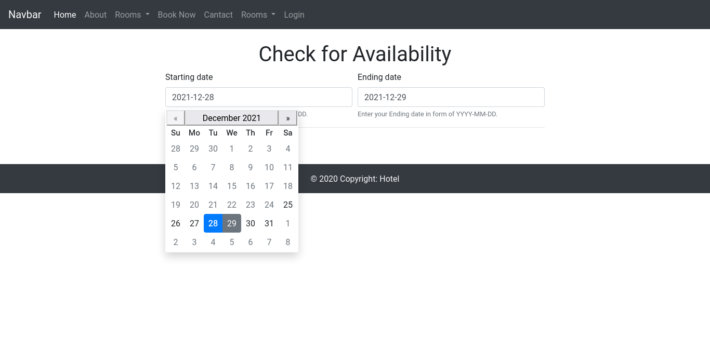
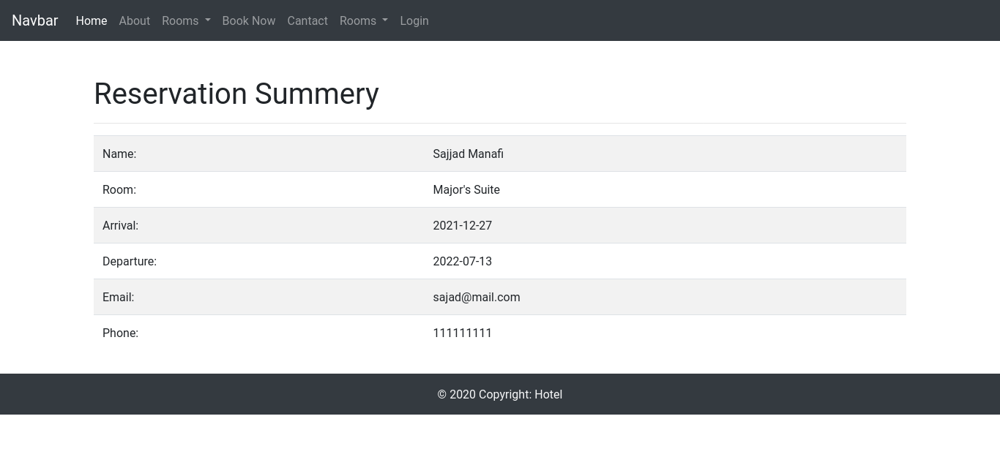
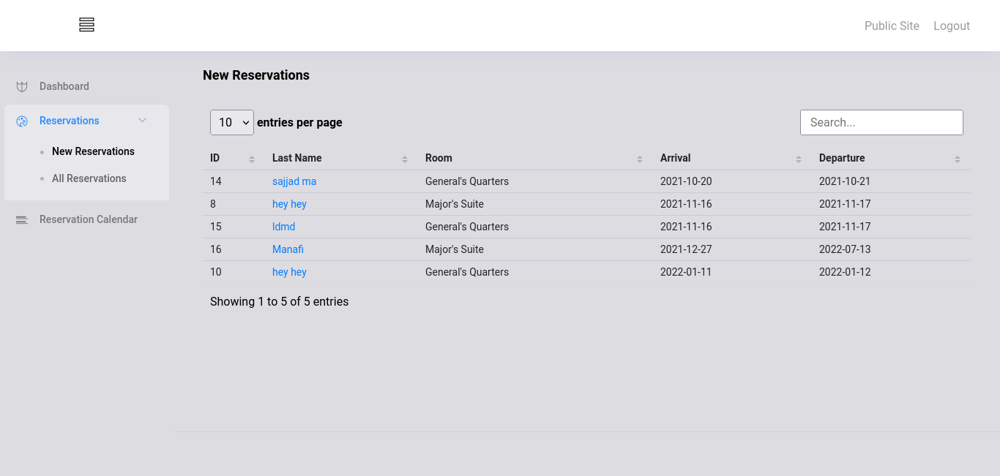
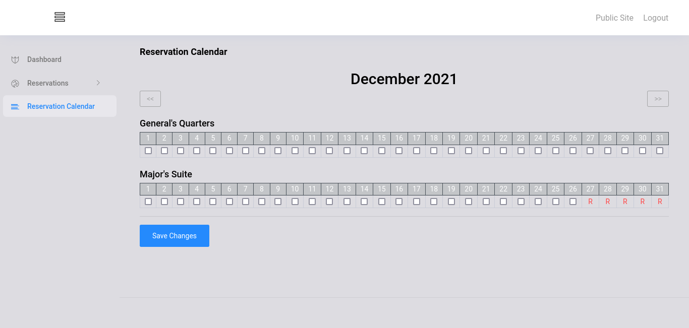

# booking
### 💻 hotel booking web project with go

## ⚡️ Features:
- [x] Template Handler
- [x] Using PostgreSQL database
- [x] Mail Handler
- [x] Middleware
- [x] Admin dashboard with Reservation Calendar and Reservation Proceess
- [x] And...🤔

### Packages used:
- [SCS: HTTP Session Management for Go](https://github.com/alexedwards/scs)
- [go-chi router](https://github.com/go-chi/chi)
- [pgx - PostgreSQL Driver and Toolkit](https://github.com/jackc/pgx)'
- [nosurf](https://github.com/justinas/nosurf)
- and ...

#### main page :

#### check for availability:

#### Reservation summery:

#### Admin DashBoard:

#### Admin Reservation Calendar:

